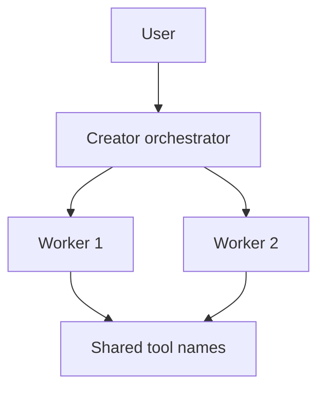

# Режим: creator

## Реализация

- Оркестрация: `Agent/creator_mode.py`, `Agent/creator_orchestration.py`; UI — дерево воркеров в `ActiveAgentsPanel`.
- В TUI `creator` включает `agent_mode=True` для набора тулов (браузер по prefs), см. `_sync_tui_tool_bundle("creator")`.
- Параллельность и стратегия: prefs `orchestration_mode`, `orchestration_max_workers` в `Interface/ui_prefs.py`.

## Схема потока

## Инструменты

Те же имена тулов, что у основного агента в режиме Agent (включая компактные). Воркеры не должны конфликтовать по одним и тем же путям — следует промпту режима в `_MODE_ADDONS["creator"]`.
