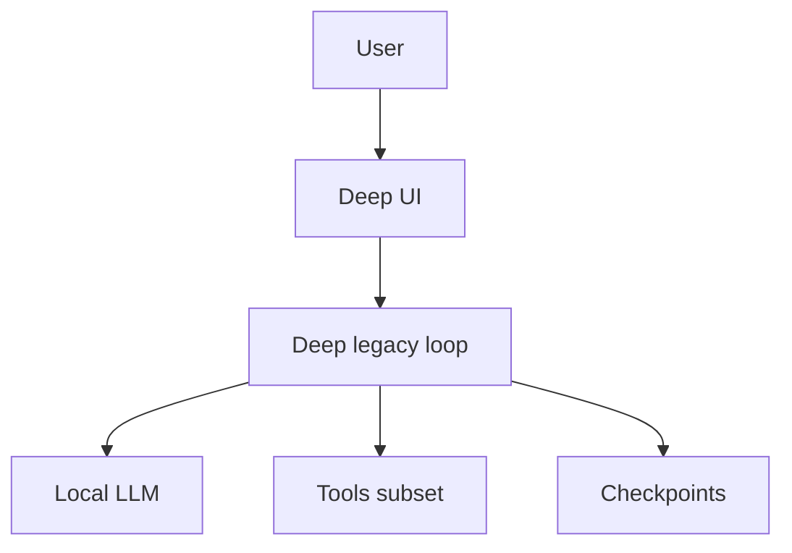

# Режим: deep (Deep Solver)

## Реализация

- **Отдельный цикл**, не стандартный LangGraph-чат: `Agent/deep_solver/legacy_loop.py` (локальная модель Ollama и т.д.).
- Старт из UI / команды; сообщения во время прогона попадают в очередь сессии (`submit_user_message`), второй Deep не создаётся.
- Чекпойнты: периодические снимки через существующий checkpoint API; карточки в UI. См. `Agent/deep_solver/legacy_loop.py` и `Interface/panels/deep_checkpoint.py`.

## Переменные окружения

Читаются через `env_pref` в `Agent/runtime_paths.py`: сначала `LORNE_<suffix>`, затем `TCA_<suffix>`.

| Переменная | Смысл |
|------------|--------|
| `LORNE_DEEP_MAX_STEPS` / `TCA_DEEP_MAX_STEPS` | Макс. раундов с тулами; `0`, пусто, `unlimited`, `inf` — практически без лимита |
| `LORNE_DEEP_MIN_RUNTIME_SEC` / `TCA_DEEP_MIN_RUNTIME_SEC` | Мин. время работы до принятия `deep_final_done` (по умолчанию 20 мин) |
| `LORNE_DEEP_MIN_STEPS` / `TCA_DEEP_MIN_STEPS` | Мин. шагов до `deep_final_done` (по умолчанию 40) |
| `LORNE_DEEP_EXIT_ONLY_ON_USER_STOP` / `TCA_DEEP_EXIT_ONLY_ON_USER_STOP` | Если `1`, выход только по стопу пользователя |

Дополнительно: `LORNE_SKIP_BRAIN_SYNC` — пропуск переиндексации brain после хода (см. `Agent/project_brain/agent_architecture.py`).

## Схема потока

## Инструменты

Используется привязка тулов к локальному LLM внутри цикла Deep (набор согласуется с конфигурацией запуска; не дублирует отдельный `ask_mode` чата). Подробности фона и субагентов: [BACKGROUND_AND_DEEP.md](../BACKGROUND_AND_DEEP.md).
